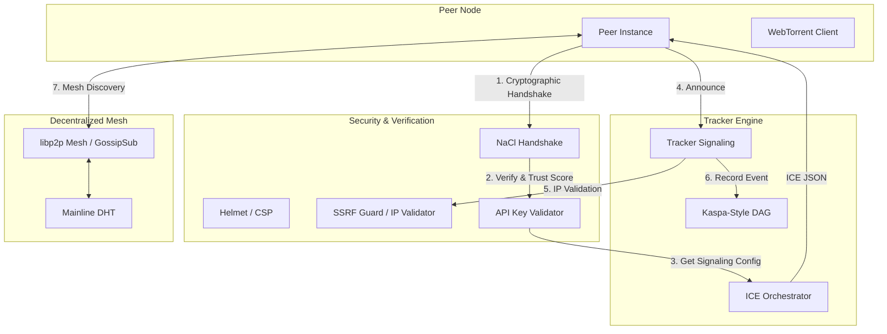

# 🚀 Ultra-Secure P2P Signaling & Tracker Node

A professional-grade BitTorrent/libp2p hybrid tracker designed for high-throughput signaling and decentralized peer discovery. This node acts as a secure "Orchestrator" for distributed swarms, implementing advanced cryptographic handshakes, multi-layered ICE management, and a Kaspa-inspired verifiable DAG for network events.

## 📊 System Architecture

The following diagram illustrates the high-level signaling flow and peer discovery mechanism:

---

## 🛡️ Security & Hardening

This tracker is built with a "Zero-Trust" architectural philosophy:

- **Iroh-Style Handshake**: Peer identities are tied to public keys. Every connection is cryptographically verified using `tweetnacl` to prevent ID spoofing.
- **SSRF Guard**: Strict validation of peer IPs against a global routable registry. Private IP blocks and local loopbacks are automatically rejected to prevent server-side request forgery.
- **Hardened Headers**: Full `Helmet` integration with strict Content Security Policy (CSP), XSS protection, and frame-guarding.
- **API Filtering**: All tracker announcements and ICE requests require a valid backend API key, preventing unauthorized swarm scraping.
- **Privacy Masking**: The specialized "ICE JSON Buffer" provides a read-only, masked view of network parameters, hiding sensitive credentials even during inspection.

## 🌐 Decentralized Networking

The system operates across multiple discovery layers simultaneously:

1.  **Multi-Layered ICE**: Orchestrates STUN servers for direct P2P and TURN relays (Public & Private) for peers behind restrictive NATs.
2.  **libp2p Mesh**: Integrated GossipSub mesh for real-time propagation of "global-search" queries across the network.
3.  **BitTorrent Mainline DHT**: Cross-compatibility with the global DHT network for massive peer availability.
4.  **Kaspa-Inspired DAG**: All signaling events are recorded into a Directed Acyclic Graph (DAG) with GHOSTDAG-inspired blue-score headers, providing a verifiable log of network activity.

## 🚀 Performance Features

- **Prometheus Metrics**: Full instrumentation for monitoring swarm health, peer counts, and response latencies.
- **NAT Priority Routing**: Automatically shifts TURN servers to the top of the stack for peers detected behind restrictive firewalls.
- **Memory Guard**: Self-healing loops monitor RSS memory and shed inactive swarms under high load to ensure 99.9% uptime.
- **Topological Sorting**: Address sorters prioritize IPv6 peers for modern connectivity while maintaining fallback for legacy stacks.

## 🛠️ Tech Stack

- **Server**: Node.js / Express
- **Signaling**: bittorrent-tracker (WS/HTTP/UDP)
- **P2P Core**: libp2p, bittorrent-dht, nacl (ED25519)
- **Database**: SQLite (WAL Mode) for persistent DAG storage
- **UI**: Tailwind CSS, Lucide Icons, WebTorrent (Client-side)

---

> **Protected by KaspStore Security Standards**  
> _Terminal System Deviations are automatically logged and mitigated._
